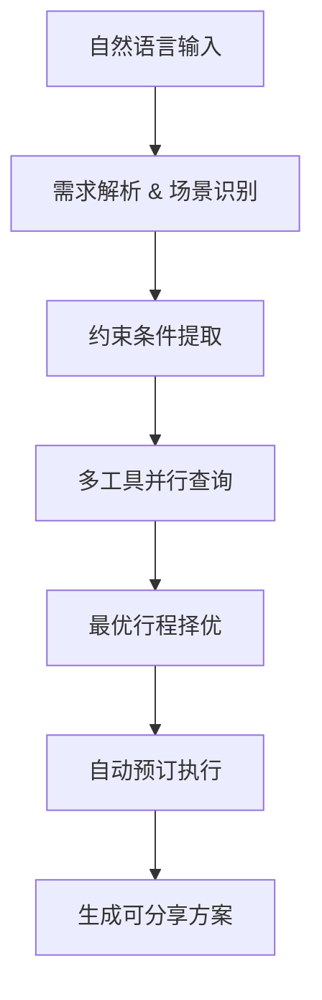
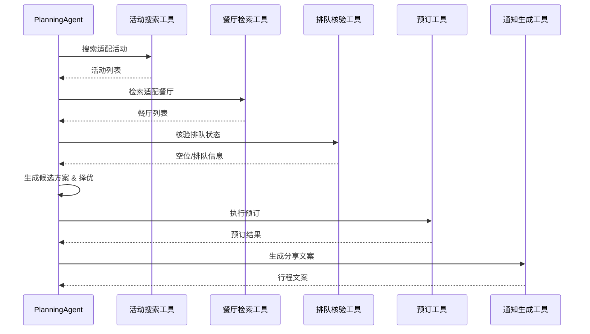

# 本地短时闲时活动规划与执行Agent设计文档

## 一、项目概述

### 1.1 项目背景

现有 `local-task-planner-agent` 基于"感知-决策-执行-记忆"四层闭环架构，具备地图检索、天气查询、用户偏好记忆、智能行程生成能力，但偏向通用任务规划，无本地短时休闲场景专属规划逻辑、商家核验及自动预订执行能力。

针对用户周末碎片化休闲需求（家庭亲子、好友小聚），基于原有项目架构进行垂直场景迭代，打造本地短时活动一站式规划执行Agent，实现自然语言需求输入、全自动路线规划、场地/餐厅实况核验、一键预订下单、行程分享闭环能力。

### 1.2 核心业务场景

| 场景类型 | 适配人群 | 核心需求 |
|---------|---------|---------|
| 家庭亲子场景 | 5岁儿童家庭 | 低强度游玩项目、低脂轻食餐饮、休闲节奏 |
| 好友聚会场景 | 4人小团体（2男2女） | 展览、citywalk、小吃团建、社交互动 |

### 1.3 核心设计目标

摒弃传统搜索式被动推荐，实现主动式全流程代办：
- 自动规划4-6小时可落地行程
- 核验场地排队及空位状态
- 完成预订下单
- 生成可分享执行方案
- 用户确认后一键落地全部流程

---

## 二、整体架构与兼容设计

### 2.1 架构复用与扩展

完全复用项目原有五层架构，仅在智能决策层和工具执行层做场景化扩展：

| 层级 | 原有能力 | 新增扩展 |
|------|---------|---------|
| 前端交互层 | Vue3+Element Plus、地图、对话、行程卡片 | 休闲行程专属展示模板 |
| 后端服务层 | FastAPI路由、日志、异常处理 | 本地活动规划专属API端点 |
| 智能决策层 | 通用规划能力 | 休闲场景规划策略、场景约束解析器、多方案择优逻辑 |
| 数据记忆层 | ChromaDB向量记忆 | 用户休闲偏好存储（亲子/聚会、饮食偏好、出行节奏） |
| 工具执行层 | 地图、天气工具 | 本地游玩、餐厅核验、排队查询、预订下单、消息通知Mock工具集 |

### 2.2 系统整体流程



---

## 三、核心规划策略（Planning策略）

### 3.1 需求约束自动解析规则

Agent自动从自然语言中提取核心约束：

| 约束类型 | 具体规则 |
|---------|---------|
| 时间约束 | 周末下午，总时长4-6小时，节奏松弛 |
| 距离约束 | 就近规划，默认城区3km范围 |
| 人群约束 | 亲子场景适配低龄儿童、低脂饮食；好友场景适配多人社交 |
| 体验约束 | 规避长时间排队、闭馆、停业场地，优先可即时预约场所 |

### 3.2 行程结构化规划规则

统一采用「游玩-就餐-轻休闲」三段式闭环结构：

| 阶段 | 时长 | 活动类型 |
|------|------|---------|
| 核心游玩阶段 | 2-2.5h | 亲子乐园、城市展览、主题街区、公园休闲 |
| 正餐就餐阶段 | 1.5h | 匹配人群饮食需求，核验空位与排队时长 |
| 附加休闲阶段 | 1h | 散步、甜品、轻社交活动 |

### 3.3 多方案择优算法

生成3套候选方案，按权重择优输出：

| 指标 | 权重 | 判定标准 |
|------|------|---------|
| 距离最优 | 40% | 整体通勤距离最短，无绕路 |
| 体验最优 | 35% | 排队时长≤20分钟，场地适配人群属性 |
| 节奏最优 | 25% | 时间分配均匀，无赶场、无空闲空档 |

---

## 四、工具调用链路设计

### 4.1 新增场景化工具集（Mock API）

| 工具名称 | 功能描述 | 适配规范 |
|---------|---------|---------|
| 本地活动搜索工具 | 根据人群、距离、时段检索适配游玩项目 | 复用原有工具调用规范 |
| 智能餐厅检索工具 | 匹配减肥餐、多人团建等定制化餐饮需求 | 复用密钥降级逻辑 |
| 排队空位核验工具 | 实时查询餐厅/场地排队人数、剩余空位 | Mock实现 |
| 活动/餐厅预订工具 | 一键预约、下单、占位操作 | Mock实现 |
| 行程通知生成工具 | 输出标准化可分享行程文案 | 格式化输出 |

### 4.2 完整调用时序链路



---

## 五、异常处理与容错机制

| 异常场景 | 处理策略 | 效果保障 |
|---------|---------|---------|
| 场地/餐厅满员 | 自动同半径替换同类型备选场地，优先选择排队＜20分钟资源 | 流程不中断 |
| 场地临时停业 | 触发兜底资源池，自动替换适配游玩项目 | 方案不失效 |
| API调用超时 | 启用Mock兜底数据 | 规划流程正常走完 |
| 时间冲突 | 智能微调各环节时长，整体维持4-6小时 | 行程合理 |
| 预订执行失败 | 记录错误日志，返回手动预约入口，保留完整行程 | 用户可手动完成 |
| 密钥异常 | 复用项目原有fallback逻辑，自动切换Mock模式 | Demo全流程可用 |

---

## 六、个性化与记忆能力

复用项目Chroma向量记忆能力，持久化存储用户休闲偏好：

| 偏好维度 | 存储内容 | 应用场景 |
|---------|---------|---------|
| 出行类型 | 亲子出行、好友聚会 | 场景识别 |
| 饮食偏好 | 低脂、素食、口味偏好 | 餐厅推荐 |
| 社交属性 | 多人社交、私密独处 | 活动适配 |
| 游玩偏好 | 展览、公园、主题乐园 | 活动推荐 |

---

## 七、输出交付规范

最终输出可直接落地、可分享、可一键执行的完整行程：

```json
{
    "itinerary_id": "ITN-xxx",
    "title": "周末亲子乐园一日游",
    "total_duration": "5小时",
    "schedule": [
        {"time": "10:00", "activity": "出发", "location": "家"},
        {"time": "10:30", "activity": "XX亲子乐园", "location": "XX路XX号", "booking_status": "confirmed"},
        {"time": "12:30", "activity": "午餐", "location": "XX餐厅", "booking_status": "booked"},
        {"time": "14:00", "activity": "甜品下午茶", "location": "XX咖啡馆"},
        {"time": "15:00", "activity": "返程"}
    ],
    "estimated_cost": "300-400元",
    "share_text": "周末亲子乐园一日游安排已生成，点击查看详情..."
}
```

---

## 八、项目迭代价值与差异化

| 对比维度 | 传统旅游规划Agent | 本项目方案 |
|---------|------------------|-----------|
| 场景聚焦 | 通用旅游规划 | 本地短时周末休闲 |
| 数据隐私 | 云端处理 | 本地大模型私有化部署 |
| 执行能力 | 仅推荐 | 实景核验+自动预订 |
| 落地效果 | 信息搜索 | 事项代办 |

**核心价值**：解决传统AI规划"只推荐、不落地"的行业痛点，实现从「信息搜索」到「事项代办」的能力升级。

---

**文档版本**：v1.0  
**适用项目**：local-task-planner-agent  
**交付形态**：Web UI / 命令行 Demo  
**文档页数**：2页（精简完整版）
